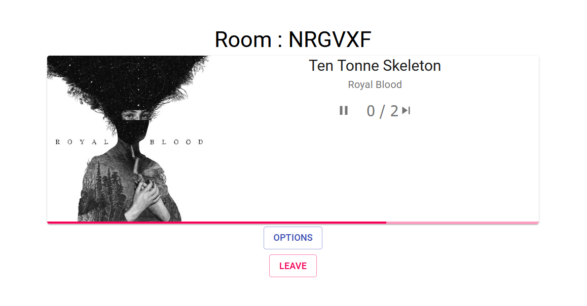

## Music Player application

This is a music player application which uses the Spotify Web API.

Unfortunately there is a lot of work to do before deploying it to production.

Currently implemented:

- Authentication
- Live updates from Spotify (kind of, they don't have support for websockets)
- Play/Pause/Skip song

## Folders

- `api` folder contains the backend REST API
- `frontend` folder contains the Javascript + React code
- `spotify` folder contains the core logic for connecting to the Spotify Web API
- `main` is the main django application

### Preview



### Building from source

Setup a `credentials.txt` in spotify folder with the following contents:

```
CLIENT_ID=__Your client id__
CLIENT_SECRET=__Your client secret__
REDIRECT_URI=http://127.0.0.1:8000/spotify/redirect
```

Note that there is no spaces around the equal sign. You can set these up in the [Spotify Developer Dashboard.](https://developer.spotify.com/dashboard/)

```shell
cd frontend && npm run dev
```

then in the projects root directory, run

```shell
python manage.py runserver
```

### TODO

- Rewrite React to functional components

#### Disclaimer

This project initially was a follow-along from the tutorial series of Tech with Tim.
